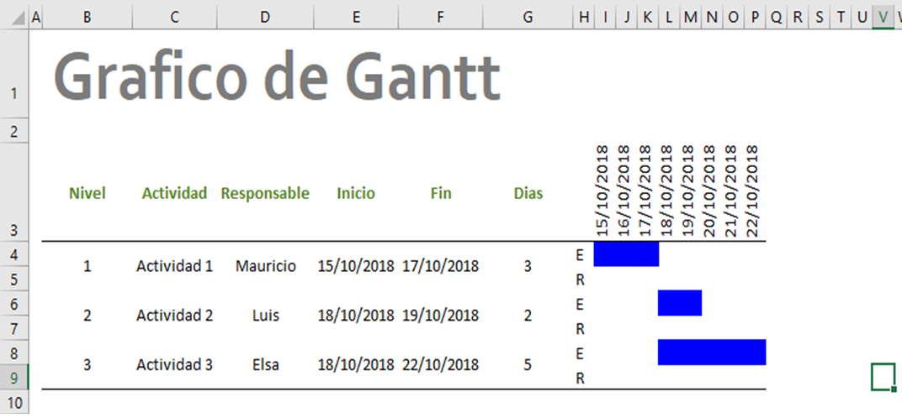

# Diagramas de Gantt
---
 

## Macros para la creación

Con esta macro se pretende facilitar el proceso de creación de Gráficos de Gantt. El "Gantt project planner" como plantilla de Excel es aceptable, sin embargo, la macro busca automatizar el proceso de creación y dar mayor flexibilidad en la duración del proyecto.
Integrar la creación automática del gráfico de Gantt a Excel puede ser muy beneficiosa, ya que en ocaciones es más comodo usar todo la información en una sola plataforma, sumado a que algunos colaboradores no tendran acceso a "Microsoft Project" por ejemplo.
Ya que deben de adquirirlo, aprender a utilizarlo y regularmente se presenta de vuelta en Excel. 
La creación de gráficos de Gantt se construye mediante dos macros: Insertar y Grafico_Gantt.

>Macro: Se usa para tareas que se realizan reiteradamente en Excel, con el fin de automatizarlas. Esta puede ser programada mediante el lenuaje de programación Visual Basic.

"Insertar" tiene como fin programar las actividades en días, donde se pide el nombre de las tareas, los responsables de cada actividad, el inicio y el fin de las actividades en días.

>Gráfico de Gantt: Es una herramienta que tiene por objetivo expresar el tiempo esperado y real de las actividades de un proyecto. 
"Grafico_Gantt" tiene como objetivo la creación del diagrama. Se puede especificar el título, lo demás estará dado por la tabla de "Insertar" (macro 1). 

 

## Criterios a considerar
* El inicio y el fin de las actividades es el tiempo en el cual esperamos (<b>E</b>) realizar la actividad. 
* Las fechas se ingresan en las casillas <b>Inicio</b> y <b>Fin</b> en la forma: dd/mm/aaaa. Sin embargo, funciona bien con números enteros.
* "Insertar" (macro 1) usa formularios para ingresar los datos, al finalizar únicamente se debe de cerrar esta.
* Una vez creado el diagrama se recomienda actualizar las casillas del tiempo real: <b>R</b>.

## Instalación
El script fue realizado en Microsoft Excel 2016. Se debe insertar como módulo dentro del entorno de programación de Excel. Recuerda que son dos scripts los que hay que correr. Primero "Insertar" y despues "Grafico_Gantt".
¡Suerte en tu proyecto!
